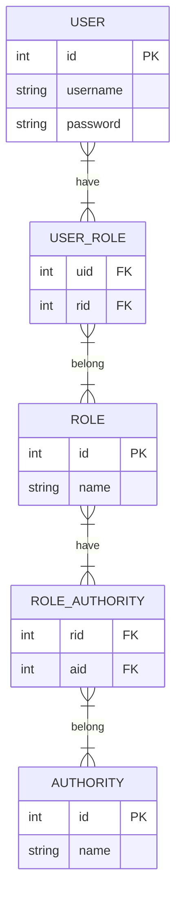

# RBAC Alpha

## Description

This is a simple application based on Role Base Access Control (RBAC) and integrated with Spring Boot + Spring Security.

## Data 

### MySQL

MySQL is chosen to store the data of users, roles and authorities.

### Redis

Redis is chosen to store use information like authorities after login

## Run

- Run the application.
- After running the application and creating tables in database successfully, Insert data from `data.sql` into the database as initial data.
  - `data.sql` in `resources` folder

## Testing

- `AccountController` 
- `HelloController`

